# PYNQ-Z2_DPU_TRD

Reference: https://github.com/alexhegit/zc702_dpu140_trd

# Running Yolo on PYNQ-Z2 ( DPU v1.4) 

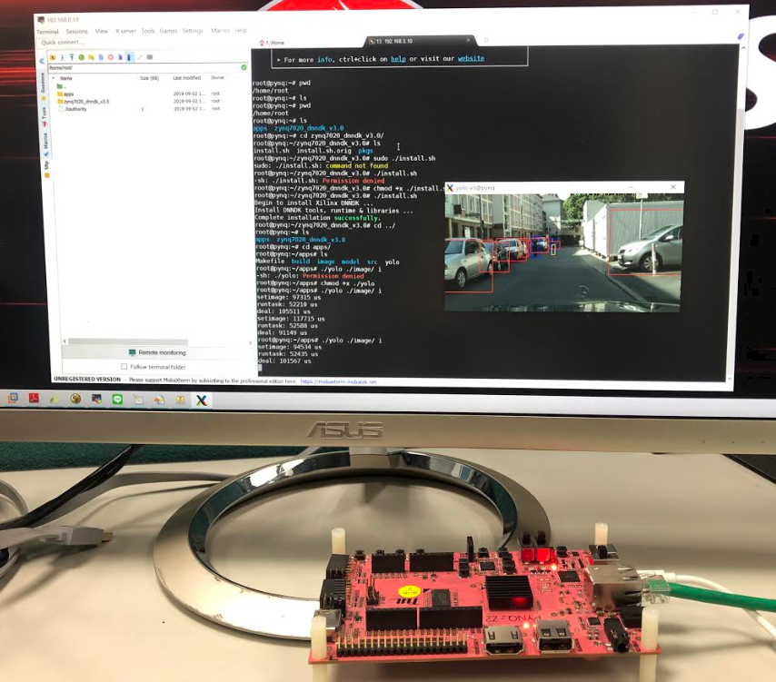

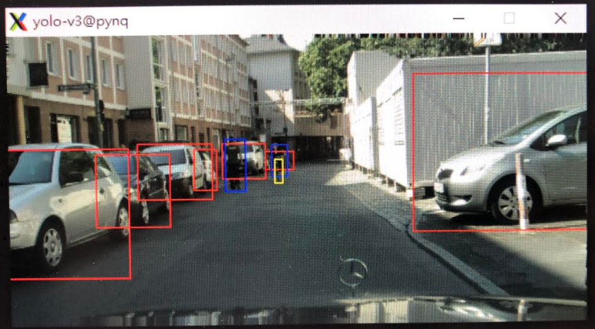

# Quick Start 
## Prerequisites

     - Xilinx Vivado v2018.3
     - Xilinx Petalinux v2018.3
     - Xilinx DNNDK v3.0
     - Xilinx DPU IP v1.4.0
	
# File tree in this git project
## Vivado Design Suite

1. Create a new project for the PYNQ-Z2.
2. Add the DPU IP to the project.
3. Use a .tcl script to hook up the block design in the Vivado IP integrator.
4. Examine the DPU configuration and connections.
5. Generate the bitstream
6. Export the .hdf file.

## PetaLinux
1. Create a new PetaLinux project with the "Template Flow."
2. Import the .hdf file from the Vivado Design Suite.
3. Add some necessary packages to the root filesystem.
4. Update the device-tree to add the DPU.
5. Build the project.
6. Create a boot image.

## Application
1. install DNNDK v3.0


# Building the Hardware Platform in the Vivado Design Suite
## Step 1: Create a project in the Vivado Design Suite
1. Create a new project based on the PYNQ-Z2 boards files
     - Project Name: **pynq_dpu**

     - Project Location: `<PROJ ROOT>/vivado`
     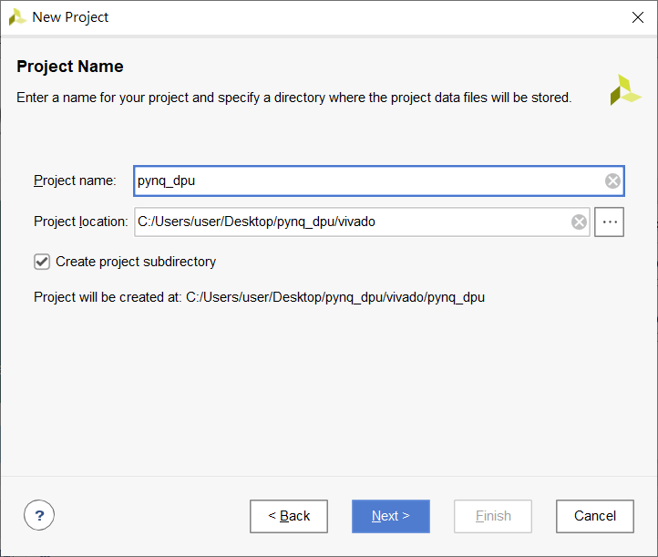

     - Do not specify sources

     - Select **PYNQ-Z2 Evaluation Platform**
 
     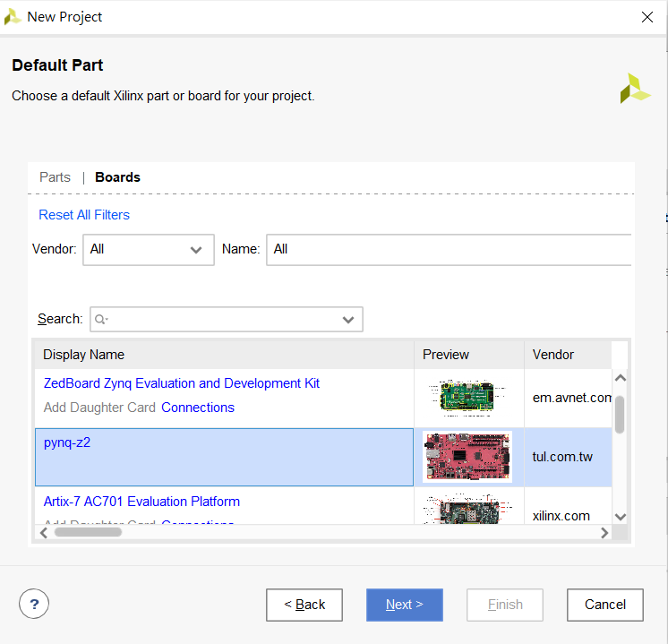
     
2. Click **Finish**.
## Step 2: Add the DPU IP repository to the IP catalog
  1. Click **Setting** in the Project Manager.
  2. Click **IP Repository** in the Project Settings.
  3. Select **Add IP Repository** into DPU IP directory. ( `<PROJ ROOT>/vivado/dpu_ip_v140` )
  4. Click **OK**.
  
## Step 3: Create the Block Design
  1. Open the TCL Console tab, `cd` to the `<PROJ ROOT>/vivado` directory, and source the `.tcl` script :
  
     ```
     source design_1.tcl
     ```
     
 
  2. Click **Regenerate Layout** in the Block Design     
	   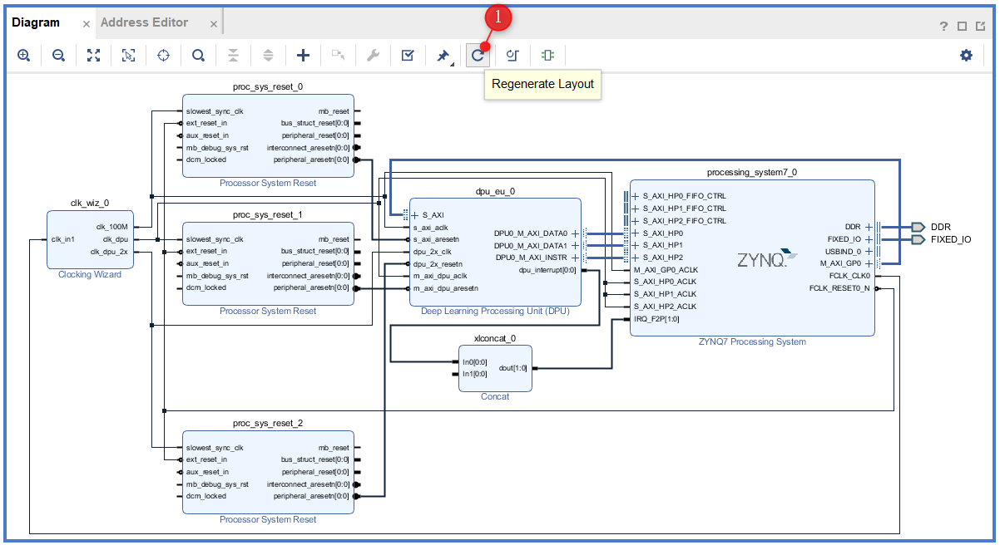
 
## Step 4: Examine the DPU configuration and connections
The details in step by step can refer to PG338 and here just some highlight attentions.
- S_AXI Clock @ 100MHz
- M_AXI Clock @ 150MHz for DPU and Clock @ 300MHz for DPU DSP
- DPU IRQ connect to IRQ_F2P[0]

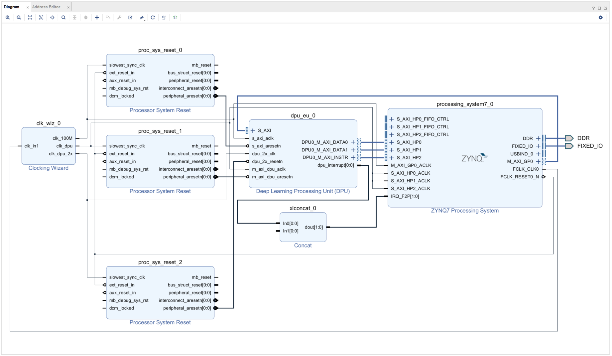


- DPU S_AXI address set 0x4F000000 - 0x4FFFFFFF(16M)

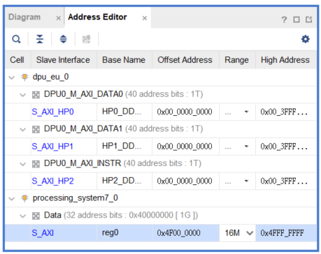

 When the block design is complete, right-click on the **design_1** in the Sources tab and select **Create HDL Wrapper**.


## Step 5: Generate the bitstream
1. Click **Generate Bitstream**. 

The FPGA resource for DPU 1152 on PYNQ-Z2
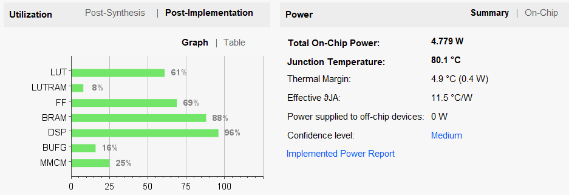
## Step 6: Export the .hdf file.
  1. Click **File** > **Export** > **Export Hardware**.
  2. Make sure to include the bitstream.
  3. Click **OK**.
  
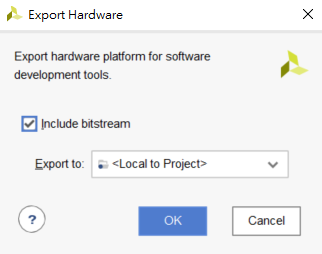

You can find the HDF from the path `<PROJ ROOT>/pynq_dpu/vivado/pynq_dpu/project_1.sdk`
# Generating the Linux Platform in PetaLinux

You may export the HDF(*.hdf) from Vivado projcet to Petalinux project here

## Step 1: Create a PetaLinux project
```
source /opt/pkg/petalinux/2018.3/settings.sh
cd  <PROJ ROOT>
petalinux-create -t project -n pynq_dpu --template zynq
```
## Step 2: Import the .hdf file

```
$cd pynq_dpu
$petalinux-config --get-hw-description=[PATH to vivado HDF file]
```
Set SD rootfs mode Petalinux-config Menu run auto after imported HDF. 

Please set SD rootfs by : 
**Image Packaging Configuration** --> **Root filesystem type (SD card)** --> **SD card**
 


## Step 3: Copy recipes to the PetaLinux project
1. Add a recipe to add the DPU utilities, libraries, and header files into the root file system.
```
$cp -rp <PROJ ROOT>/petalinux/meta-user/recipes-apps/dnndk/ project-spec/meta-user/recipes-apps/
```
2. Add a recipe to build  the DPU driver kernel module.
```
$cp -rp <PROJ ROOT>/petalinux/meta-user/recipes-modules project-spec/meta-user
```
3. Add a recipe to create hooks for adding an “austostart” script to run automatically during Linux init.
```
$cp -rp <PROJ ROOT>/petalinux/meta-user/recipes-apps/autostart project-spec/meta-user/recipes-apps/
```
4. Add a `bbappend` for the base-files recipe to do various things like auto insert the DPU driver, auto mount the SD card, modify the PATH, etc.
```
$cp -rp <PROJ ROOT>/petalinux/meta-user/recipes-core/base-files/ project-spec/meta-user/recipes-core/
```
5. Add DPU to the device tree
At the bottom of `project-spec/meta-user/recipes-bsp/device-tree/files/system-user.dtsi`, add the following text:

```
/include/ "system-conf.dtsi"
/ {
	amba_pl: amba_pl {
		#address-cells = <1>;
		#size-cells = <1>;
		compatible = "simple-bus";
		ranges ;
		dpu_eu_0: dpu_eu@4f000000 {
			clock-names = "s_axi_aclk", "dpu_2x_clk", "m_axi_dpu_aclk";
			clocks = <&misc_clk_0>, <&misc_clk_1>, <&misc_clk_2>;
			compatible = "xlnx,dpu-eu-2.0";
			interrupt-names = "dpu_interrupt";
			interrupt-parent = <&intc>;
			interrupts = <0 29 4>;
			reg = <0x4f000000 0x1000000>;
		};
		misc_clk_0: misc_clk_0 {
			#clock-cells = <0>;
			clock-frequency = <100000000>;
			compatible = "fixed-clock";
		};
		misc_clk_1: misc_clk_1 {
			#clock-cells = <0>;
			clock-frequency = <300000000>;
			compatible = "fixed-clock";
		};
		misc_clk_2: misc_clk_2 {
			#clock-cells = <0>;
			clock-frequency = <150000000>;
			compatible = "fixed-clock";
		};
	};
};

&dpu_eu_0{
        compatible = "xilinx,dpu";
};
```
Note: the **reg = <0x4f000000 0x1000000>** should be match with the DPU S_AXI address set **0x4F000000 ** ( Vivado : Step 4)


## Step 4: Configure PetaLinux to install the `dnndk` files

  ```
  $vi project-spec/meta-user/recipes-core/images/petalinux-image.bbappend
  ```

  Add the following lines:

  ```
    IMAGE_INSTALL_append = " dnndk"
    IMAGE_INSTALL_append = " autostart"
    IMAGE_INSTALL_append = " dpu"
  ```
## Step 5: Configure the rootfs

Use the following to open the top-level PetaLinux project configuration GUI.

  ```
  $petalinux-config -c rootfs
  ```

1. Enable each item listed below:

   **Filesystem Packages ->**
     - console -> utils -> pkgconfig -> pkgconfig
     
   **Petalinux Package Groups ->**
     - opencv
     - opencv-dev
     - v4lutils
     - v4lutils-dev
     - self-hosted
     - self-hosted-dev
     - x11

   **Apps ->** 
     - autostart
     
   **Modules ->**
     - dpu
   
2. **Exit** and **save** the changes.
  
## Step 6: Build the kernel and root file system

  ```
  $petalinux-build
  ```

## Step 7: Create the boot image

  ```
  $cd images/linux

  petalinux-package --boot --fsbl --u-boot --fpga 
  ```
## Step 8: Boot the linux image
1. Prepare SD card and partion it by `gparted `.
  
  ```
  $sudo gparted
  ```
  If `gparted` is not installed, enter
  
  ```
  $sudo apt-get install gparted
  ``` 
  
  
  Select SD card in `gparted `
  
  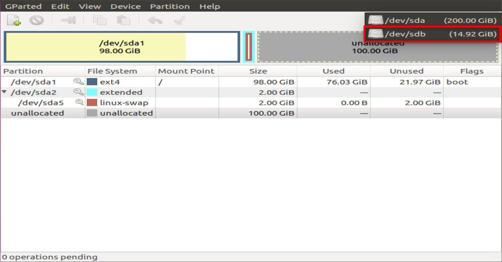

  Umount the SD card and delete the existing partitions on the SD card
  
  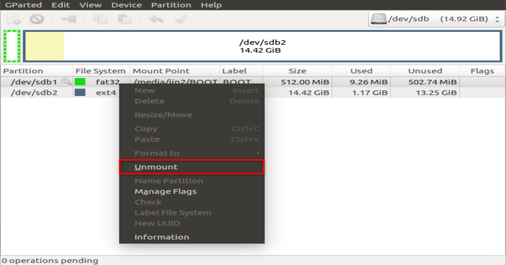
    
  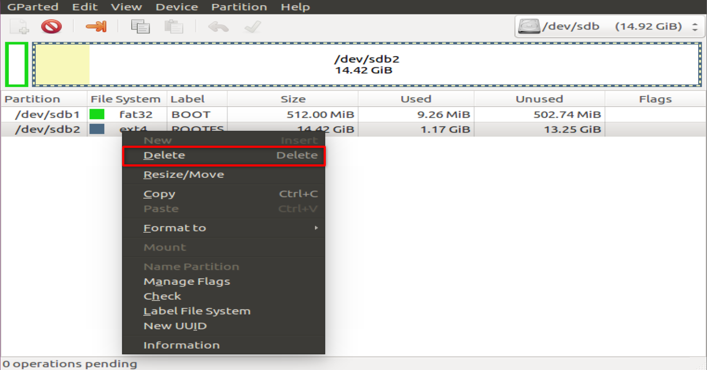

  Unallocated in Gparted
    
  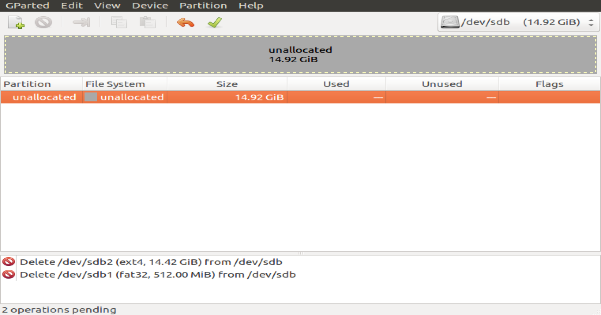
   
  Right click on the allocated space and create a new partition according to the settings below
    
  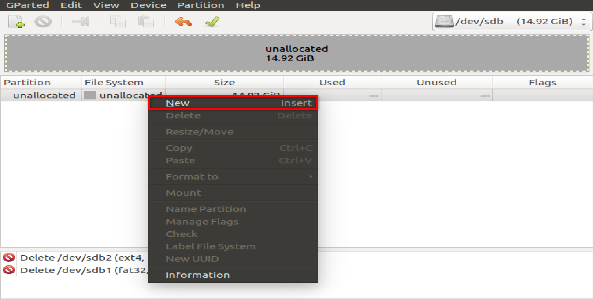
  
  The first is BOOT partioin in FAT32
  
  
  
  The second is ROOTFS partion in ext4
  
  
  
  Turn off `gparted ` and mount the two partitions you just formatted.

  Copy images files to SD card(BOOT.bin and image.ub to BOOT partion and extract rootfs.tar.bz2 into ROOTFS partion.)
  
  
  ```
  $sudo tar xzf rootfs.tar.gz -C /media/{user}/ROOTFS/
  
  $cp BOOT.bin image.ub /media/{user}/BOOT
  ```
  
2. Boot the PYNQ-Z2 with this image
 

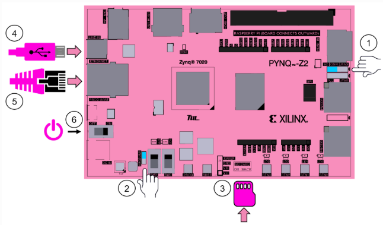 
 


     PYNQ-Z2 Board Setup 
     
     - 1.Set the ** Boot ** jumper to the SD position. (This sets the board to boot from the Micro-SD card)
 
     
     - 2.To power the board from the micro USB cable, set the Power jumper to the USB position
      
     - 3.Insert the Micro SD card loaded with the image into the Micro SD 
     
     - 4.Connect the ** USB cable ** to your PC/Laptop, and to the PROG - UART MicroUSB port on the board
     
     - 5.Connect the ** Ethernet cable **  to your PC/Laptop, and to the RJ45 port on the board
     
     - 6.Turn on the PYNQ-Z2
    
   
   Opening a USB Serial Termina
l
   
   You will need to have terminal emulator software installed on your computer, and ** Tera Term ** is one application that can be used. 
   To open a terminal, you will need to know the  ** COM port **  for the board.  
     
   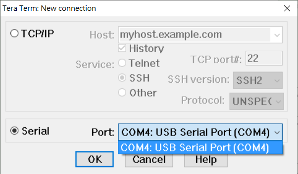 
    
      
    ** Setup **  ->   ** Serial Port ** 
         
   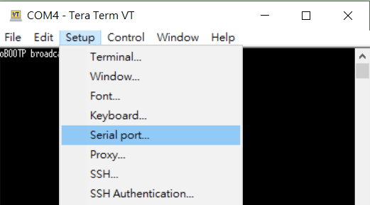 
   
   Full terminal Settings:
 
   
			• 115200 baud
			• 8 data bits
 
			• No Parity  
			• 1 stop bit
 
		
     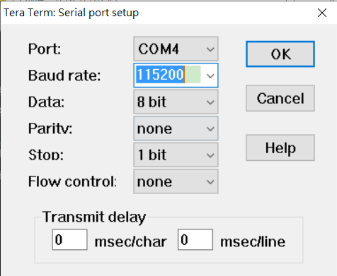 
 
     
  
 Login by enter ** root ** 
   Password :  ** root ** 
     
    
 
                     
# Application #
 
Before Running the application , you should copy DNNDK Tools and Application to the Evaluation Board
  
  1. Install DNNDK into PYNQ-Z2 board
     - Execute the sudo ./install.sh command under the zynq7020_dnndk_v3.0 folder 
     ```
     $./zynq7020_dnndk_v3.0/install.sh
 
     ```
 
   
     - Check the DPU of the board.   
     ```
     $dexplorer -w
     ```
     
     - Check the version information of DNNDK  
     ```
     $dexplorer -v 
     ```
    

 2. Run the yolov3 applications 
     - Change to the directory with the `app` application and run make 
       
     ```
     $cd <PROJ ROOT>/app
     $make
     ```
 
 
     
     - After running make and launch it with the command
      
     ```                            
     ./yolo ./image i
     ```


